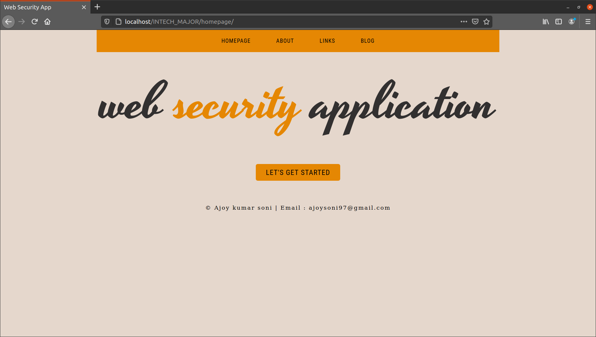
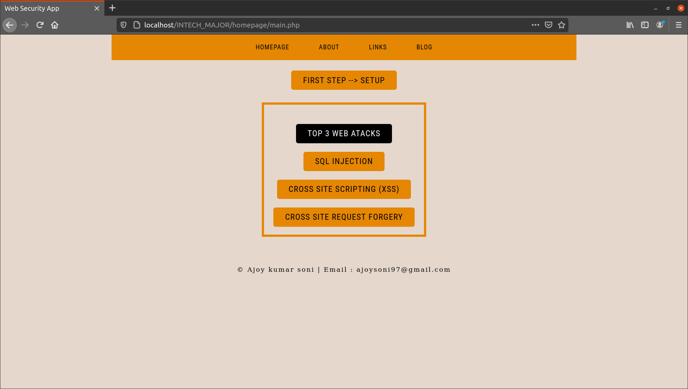
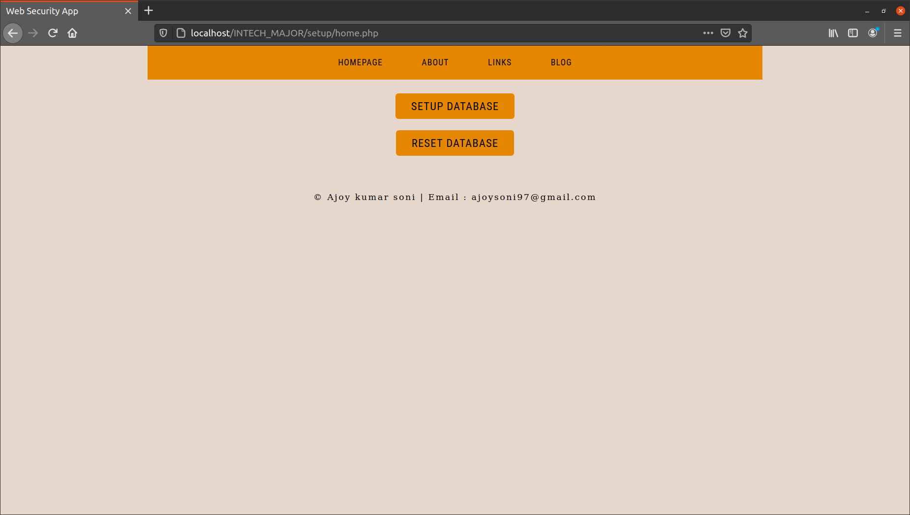
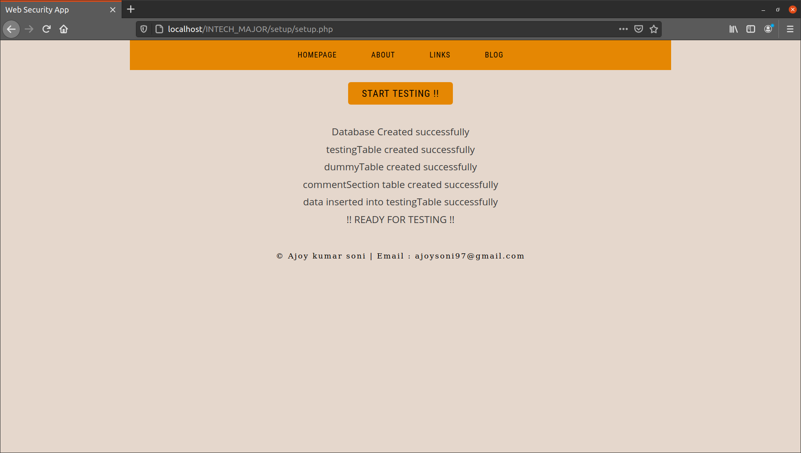
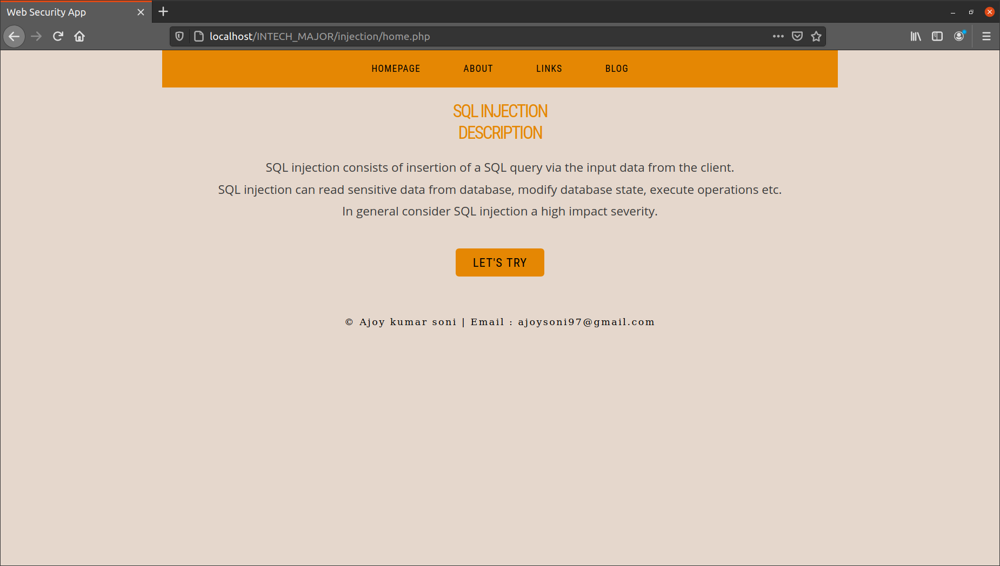
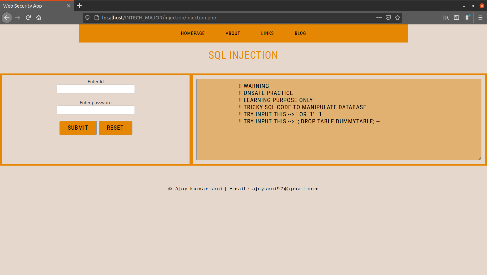
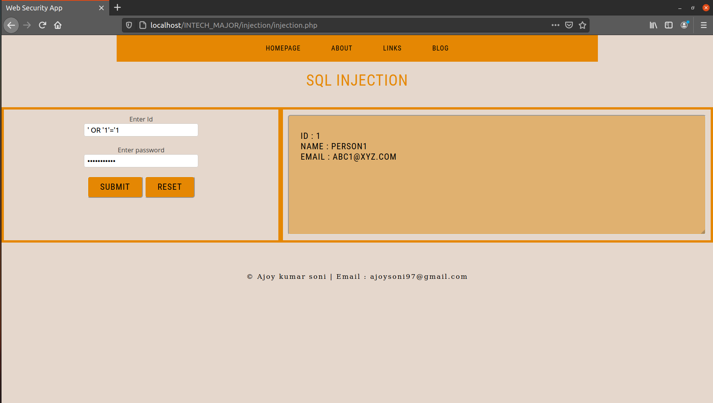

# Web-Security-Application
## Understanding basics of web security

<!-- TABLE OF CONTENTS -->
<details open="open">
  <summary><h2 style="display: inline-block">Table of Contents</h2></summary>
  <ol>
    <li>
      <a href="#">About The Project</a>
    </li>
    <li>
      <a href="#">Getting started</a>
    </li>
    <li>
      <a href="#">About The Project</a>
    </li>
    <li>
      <a href="#">Installation</a>
    </li>
    <li>
      <a href="#">Usage</a>
    </li>
    <li>
      <a href="#">Few Screenshots</a>
    </li>
  
  </ol>
</details>

## About The Project
The PHP Web Security Project is an effort to get better understanding of common attacks and exploitation being carried out on poorly designed web applications.
The aim is to provide hands on experience with some of these scenarios. Some of them are :-
* SQL injection
* XSS
* Cross Site request forgery

### Built With
* PHP
* HTML/CSS/JS
* MySql

## Getting Started

To get a local copy up and running follow these simple steps.

### Prerequisites
* php
* MySql
* ~phpmyadmin

### Installation

1. Clone the repo either in var/www/html for ubuntu or xampp/htdocs for windows.
   ```sh
   git clone https://github.com/Ajoy-Soni/Web-Security-Application.git
   ```
2. Install required packages

## Usage
The database and tables with data would be setup automatically using the setup and reset features provided.
Make sure to have login credentials of MySql to be :
* username : "root"
* password : ""

Follow along with the website.
## Screenshots for SQL injection
### Cover page

### Functionalities

### Setup and Reset options

### Setup databases, tables, and insert data with one click

### SQL injection description page

### SQL injection hands on experience using AJAX

### information from database retrieved without valid input


### Similary other two attacks can be tested.


## Link
[https://github.com/Ajoy-Soni/Web-Security-Application](https://github.com/Ajoy-Soni/Web-Security-Application)

